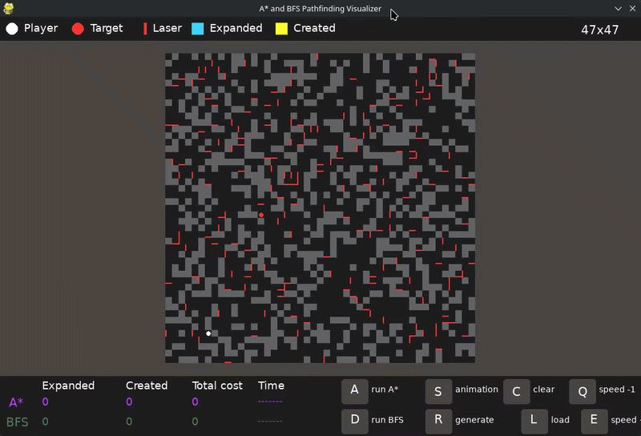
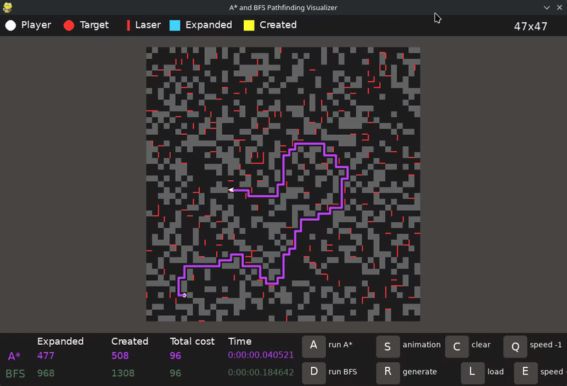

# A\* and BFS Pathfinding Visualizer

A Python pathfinding visualizer built with Pygame. The project compares **A\*** and **Breadth-First Search (BFS)** on grid-based maps with obstacles, directional barriers, animations, and runtime metrics.

The goal is to make classic AI search algorithms easier to inspect: how many nodes they create, how many they expand, how the final route is built, and how the search behaves on different map sizes.

## Features

- Visual comparison between A\* and BFS.
- Animated path rendering for the selected algorithm.
- Optional animation of created and expanded nodes.
- Built-in matrix files for different map sizes.
- Random matrix generation.
- Matrix loader using a small Tkinter modal.
- Runtime metrics: created nodes, expanded nodes, total path cost, and execution time.

## Screenshots and GIFs

### A* Search



### Breadth-First Search



## Installation

Requirements:

- Python 3.10 or newer.
- Pygame.
- NumPy.
- Tkinter support for the matrix loader modal.

Install Python dependencies:

```bash
python -m venv venv
source venv/bin/activate
pip install -r requirements.txt
```

On Windows:

```powershell
venv\Scripts\activate
pip install -r requirements.txt
```

If Tkinter is missing on Linux, install it with your system package manager. For example, on Debian/Ubuntu:

```bash
sudo apt install python3-tk
```

## Running the Visualizer

```bash
python src/GUI.PY
```

The app starts with the default matrix `18x20_1_default`.

## Controls

- `A`: run A\*.
- `D`: run BFS.
- `S`: animate created and expanded nodes after running an algorithm.
- `R`: generate and load a random matrix.
- `L`: load a matrix by name from `src/matrices/`.
- `C`: clear the current route and metrics.
- `Q`: slow down the node expansion animation.
- `E`: speed up the node expansion animation.

When loading a matrix manually, enter the file name without `.txt`. Example:

```text
18x20_1_default
```

## Map Symbols

Matrices are text files stored in `src/matrices/`. Each character represents one cell:

```text
@  agent start
*  target
1  walkable cell
X  obstacle
H  horizontal barrier
V  vertical barrier
```

The agent moves in four directions: up, right, down, and left. Movement cost is `1` per step.

## Algorithms

### A\*

A\* uses the accumulated path cost plus a Manhattan-distance heuristic:

```text
f(n) = g(n) + h(n)
```

In this project:

- `g(n)` is the accumulated movement cost.
- `h(n)` is the Manhattan distance from the current cell to the target.
- The next node is selected from the open list by the lowest `f(n)`.

### BFS

BFS explores nodes by depth using a FIFO queue. On an unweighted grid, it finds the shortest path in number of steps.

This project uses BFS as a baseline to compare against A*: BFS is straightforward and complete, while A* uses the target position to guide the search.

## Code Structure

```text
src/
├── GUI.PY                    # Pygame window, controls, rendering, and metrics
├── Agent.py                  # BFS and A* implementations
├── Node.py                   # Search node, movement rules, and heuristic
├── InputMatrixModal.py       # Tkinter modal for loading matrices by name
├── helpers/
│   └── generatorMatrices.py  # Random matrix generator
├── icons/
│   └── navigation.png        # Agent icon used in route animation
└── matrices/                 # Built-in test maps
```

### `Agent.py`

Contains both search algorithms:

- `bfs()`: explores the grid with a FIFO queue.
- `aStar()`: expands the node with the lowest `f(n)` score.

Both methods collect created and expanded nodes so the GUI can animate the search process and display metrics.

### `Node.py`

Represents a state in the search tree. It stores the matrix, current agent position, target position, accumulated cost, movement direction, and parent node.

Important methods:

- `heuristics()`: returns Manhattan distance.
- `calculate_f()`: computes the A\* score.
- `up()`, `right()`, `down()`, `left()`: generate valid neighboring states.
- `meta()`: checks whether the current node reached the target.

### `GUI.PY`

Handles the visual side of the project: window setup, keyboard controls, matrix drawing, route animation, node expansion animation, and metrics display.

The GUI delegates pathfinding to `Agent`, then reconstructs the final route by walking through each node's `parent` reference.

## Useful Change Points

- Change animation speed defaults in `GUI.__init__()`.
- Add or edit maps in `src/matrices/`.
- Adjust random map generation in `helpers/generatorMatrices.py`.
- Change the A\* heuristic in `Node.heuristics()`.
- Replace the open-list selection in `Agent.aStar()` with `heapq` if you want a more efficient implementation.
